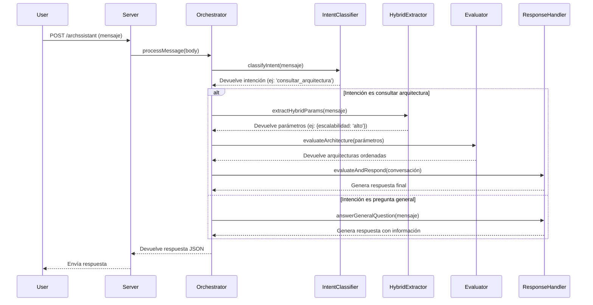
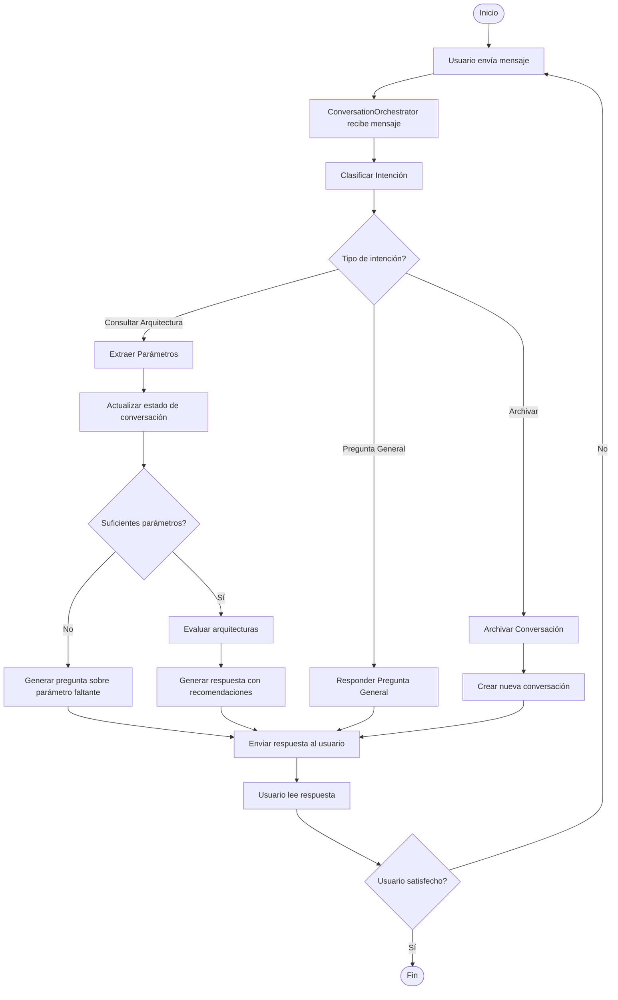
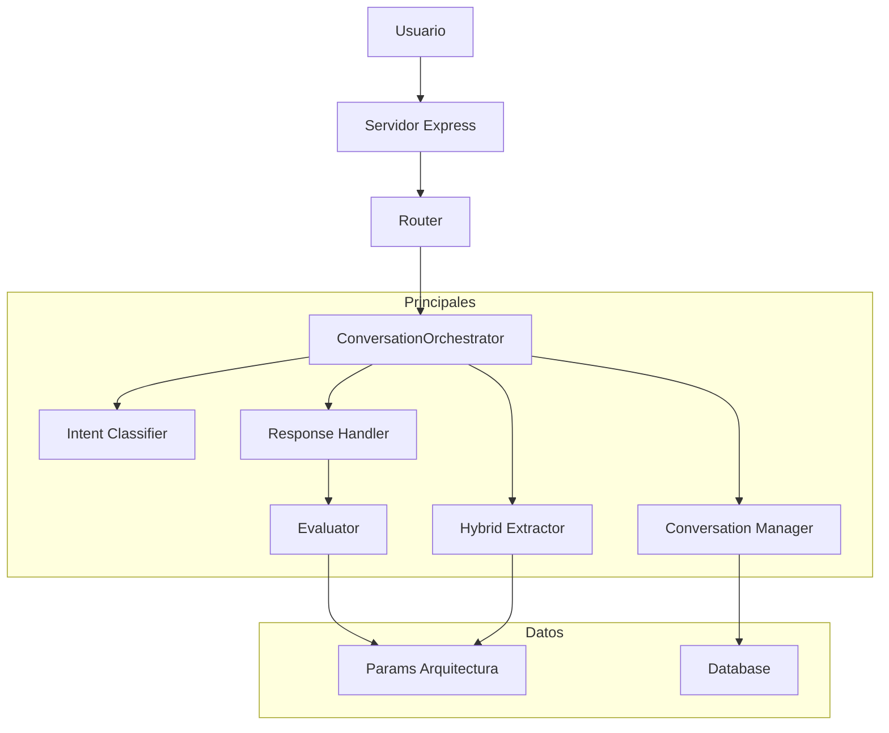

# Archssistant - Asistente de Arquitectura de Software

https://archssistant.onrender.com/

Archssistant es un asistente conversacional inteligente diseñado para ayudar a los desarrolladores y arquitectos de software a elegir la arquitectura más adecuada para sus proyectos. A través de una conversación en lenguaje natural, el asistente recopila los requisitos del sistema y recomienda la mejor opción de su base de conocimiento.

## Cómo funciona la aplicación

La aplicación se basa en una arquitectura de componentes modulares que orquestan el flujo de la conversación, procesan el lenguaje natural y evalúan las opciones de arquitectura.

El punto de entrada es `server.js`, que levanta un servidor Express y define la ruta principal `/archssistant`. Todas las solicitudes a esta ruta son manejadas por `routes/archassistant.js`, que actúa como controlador principal.

Este controlador utiliza una instancia de `ConversationOrchestrator` (`core/orchestrator.js`), el cerebro de la aplicación. El orquestador gestiona el ciclo de vida de la conversación, desde que se recibe un mensaje hasta que se envía una respuesta.

## Flujo de la Conversación

El flujo de interacción con el usuario es un ciclo continuo de preguntas y respuestas diseñado para recopilar información y ofrecer recomendaciones precisas.

1.  **Inicio de la Conversación:** El usuario envía un mensaje. El `ConversationOrchestrator` recibe el mensaje y recupera o crea una sesión de conversación para ese usuario.
2.  **Clasificación de Intención:** El orquestador utiliza el `IntentClassifier` (`core/intent/intent_classifier.js`) para determinar la intención del usuario (p. ej., "consultar arquitectura", "pregunta general", "finalizar conversación").
3.  **Extracción de Parámetros:** Si la intención es "consultar arquitectura", el `HybridExtractor` (`core/ingestion/hybrid_extractor.js`) analiza el mensaje para extraer parámetros clave como "costo", "escalabilidad" o "seguridad".
4.  **Gestión del Estado de la Conversación:** Los parámetros extraídos se guardan en el estado de la conversación actual, gestionado por `ConversationManager` (`core/conversation/conversation_manager.js`).
5.  **Evaluación y Respuesta:**
    *   Si faltan parámetros por definir, el `Explainer` (`core/ingestion/explainer.js`) genera una pregunta para solicitar al usuario la información faltante.
    *   Si se han recopilado suficientes parámetros, el `Evaluator` (`core/ingestion/evaluator.js`) entra en acción.
    *   El `ResponseHandler` (`core/conversation/response_handler.js`) consolida los resultados y genera una respuesta final para el usuario.
6.  **Ciclo de Conversación:** El ciclo se repite hasta que el usuario decide archivar la conversación, momento en el cual el historial se guarda y se inicia una nueva sesión.

### Diagrama de Flujo (Sequence Diagram)

### Ciclo de Conversación (Conversation Loop)

El siguiente diagrama muestra el ciclo completo que utiliza el `ConversationOrchestrator` para procesar cada mensaje del usuario, mostrando específicamente cómo se repite este proceso a lo largo de una conversación.

Este diagrama ilustra claramente cómo el sistema mantiene un ciclo continuo de:
1. **Clasificación** de la intención del usuario
2. **Extracción** de parámetros relevantes
3. **Evaluación** de las opciones de arquitectura
4. **Respuesta** generada para el usuario

Y cómo el sistema vuelve al inicio del ciclo cada vez que el usuario proporciona nueva información, manteniendo así una conversación fluida e iterativa.

## Arquitectura del Sistema

El sistema está diseñado con una clara separación de responsabilidades, donde cada módulo se encarga de una tarea específica.

## Búsqueda por Similitud Vectorial Basada en Distancia

El corazón de la recomendación de arquitecturas es el módulo `Evaluator`, que utiliza un método de similitud vectorial para encontrar la mejor opción. Este enfoque no depende de IA generativa, sino de un cálculo matemático preciso.

### ¿Cómo funciona?

1.  **Vectorización:** Tanto la consulta del usuario como las arquitecturas en la base de conocimiento se convierten en "vectores". Un vector es simplemente una lista de números que representa características. En este caso, los parámetros como `costo`, `escalabilidad` y `seguridad` se mapean a valores numéricos:
    *   `bajo` -> `1`
    *   `medio` -> `2`
    *   `alto` -> `3`

2.  **Cálculo de Distancia:** Para cada arquitectura, se calcula la "distancia" entre su vector y el vector del usuario. La distancia mide qué tan diferentes son los valores de cada parámetro. La fórmula utilizada es la distancia normalizada:

    `distancia = |valor_usuario - valor_arquitectura| / 2`

    El `/ 2` normaliza el resultado a un rango entre 0 (coincidencia perfecta) y 1 (máxima diferencia).

3.  **Puntuación de Similitud (Score):** La puntuación final se calcula como el inverso de la distancia promedio.

    `score = 1 - (suma_distancias / numero_parametros)`

    Un `score` de `1` significa una coincidencia perfecta, mientras que un `score` cercano a `0` indica una gran diferencia.

### Ejemplo Práctico

Supongamos que el usuario busca una arquitectura con:
*   **Escalabilidad:** `alto` (3)
*   **Costo:** `bajo` (1)

El **vector del usuario** es `{ escalabilidad: 3, costo: 1 }`.

Ahora, comparemos dos arquitecturas de la base de conocimiento:

**Arquitectura A: Monolito**
*   `escalabilidad`: `bajo` (1)
*   `costo`: `bajo` (1)

**Arquitectura B: Microservicios**
*   `escalabilidad`: `alto` (3)
*   `costo`: `alto` (3)

**Cálculo para el Monolito:**
*   Distancia de escalabilidad: `|3 - 1| / 2 = 1`
*   Distancia de costo: `|1 - 1| / 2 = 0`
*   Distancia total: `1 + 0 = 1`
*   Distancia promedio: `1 / 2 = 0.5`
*   **Score del Monolito:** `1 - 0.5 = 0.5`

**Cálculo para Microservicios:**
*   Distancia de escalabilidad: `|3 - 3| / 2 = 0`
*   Distancia de costo: `|1 - 3| / 2 = 1`
*   Distancia total: `0 + 1 = 1`
*   Distancia promedio: `1 / 2 = 0.5`
*   **Score de Microservicios:** `1 - 0.5 = 0.5`

En este caso, ambas arquitecturas tienen la misma puntuación porque cada una coincide perfectamente en un parámetro y difiere en el otro. El sistema las presentaría como igualmente viables según los criterios dados, probablemente pidiendo más información para desempatar.

Este método es rápido, eficiente y transparente, permitiendo al sistema justificar sus recomendaciones basándose en datos concretos.
