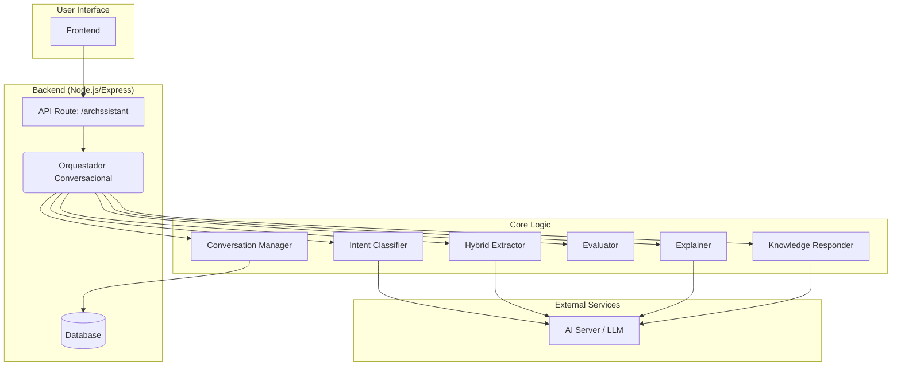
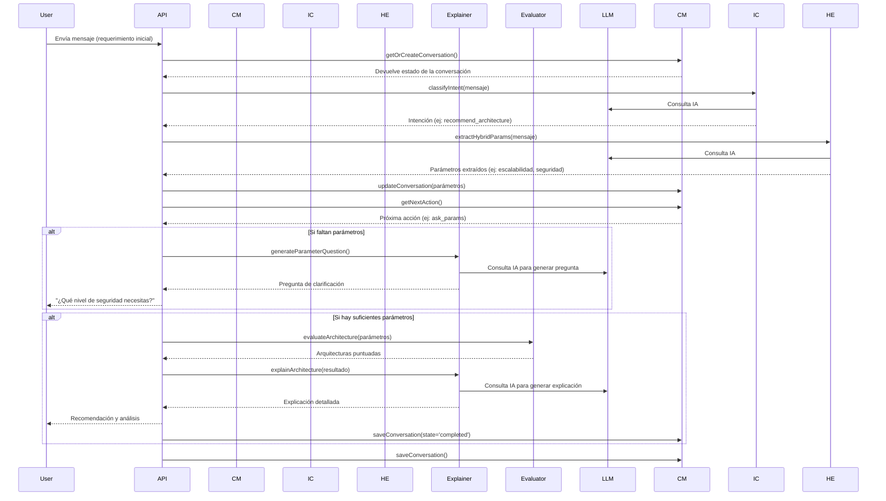

# 🧠 Archssistant


actualmente desplegado aqui https://archssistant.onrender.com/

**Archssistant** es un asistente experto en arquitectura de software, diseñado para evaluar necesidades técnicas y recomendar arquitecturas adecuadas basándose únicamente en los libros:

- *Fundamentals of Software Architecture* — Richards & Ford — ISBN: 978-1-492-04345-4  
- *Software Architecture: The Hard Parts* — Ford, Richards, Sadalage, Dehghani — ISBN: 978-1-492-08689-5

---

## 🏗️ Diagrama de Arquitectura

El sistema utiliza una arquitectura modular orquestada por un manejador de conversaciones que gestiona el estado y el flujo de la interacción.



---

## 🔄 Flujo de Procesamiento

El flujo es conversacional. El sistema mantiene el estado para recopilar parámetros, aclarar la intención y finalmente ofrecer una recomendación.



---

## ⚙️ Componentes del Core

### 1. `routes/archassistant.js` (Orquestador)
Actúa como el orquestador principal. Gestiona el flujo de la conversación invocando a los diferentes módulos del core según el estado actual de la interacción, que es manejado por el `ConversationManager`.

### 2. `core/conversation_manager.js`
Maneja el ciclo de vida y el estado de la conversación. Almacena el historial, los parámetros extraídos y la intención del usuario. Determina la siguiente acción a realizar (pedir más parámetros, recomendar, etc.). Se apoya en `db/database.js` para la persistencia.

### 3. `core/intent_classifier.js`
Utiliza un LLM para clasificar la intención del usuario a partir de su mensaje (por ejemplo, si desea una recomendación, una comparación o una pregunta general).

### 4. `core/hybrid_extractor.js`
Combina dos métodos para identificar parámetros de arquitectura relevantes:
- `param_analyzer.js`: Usa reglas predefinidas (`param_rules.json`) para un mapeo rápido.
- `extractor.js`: Usa un LLM para inferir parámetros de manera flexible a partir del lenguaje natural.

### 5. `core/evaluator.js`
Usa una matriz de decisión (`decision_engine.json`) para puntuar y clasificar las arquitecturas candidatas basándose en los parámetros recopilados.

### 6. `core/explainer.js`
Genera explicaciones detalladas sobre la arquitectura recomendada y también formula preguntas para obtener los parámetros que faltan, utilizando en ambos casos un LLM.

### 7. `core/knowledge_responder.js`
Proporciona respuestas a preguntas generales sobre arquitectura de software cuando la intención del usuario no es una recomendación.

### 8. `db/database.js`
Abstrae la lógica de la base de datos para crear, recuperar y actualizar el historial de conversaciones.

---

## 📌 Requisitos

- Node.js 20+
- `.env` con:
  - `GROQ_KEY`
  - `AISERVER`

---

## 🚧 Limitaciones Actuales

- Dependencia de calidad del LLM
- Reglas de `param_rules.json` pueden no cubrir todos los matices
- Historial almacenado solo en `storage.json`
- No entrega código ni implementaciones, solo recomendaciones

---

## 🧪 Ejemplo de uso

**Input del usuario:**  
> Somos un banco con alta necesidad de seguridad, datos sensibles y escalabilidad horizontal.

**Respuesta esperada:**
```
📊 Evaluación:
CQRS: 0.92
Microservicios: 0.78
Serverless: 0.45

🧠 Recomendación:
✅ Arquitectura sugerida: CQRS
📌 Parámetros relevantes: seguridad, escalabilidad
➕ Ventajas: separación de comandos/consultas, control granular, integridad
➖ Posibles limitaciones: complejidad de mantenimiento, curva de aprendizaje
📚 Justificación: descrito en "Fundamentals..." como ideal para dominio crítico
💬 Conclusión: Ideal para bancos que manejan información crítica
```

---

## 📁 Archivos Clave

| Archivo                         | Propósito                                        |
|--------------------------------|--------------------------------------------------|
| `core/hybridExtractor.js`      | Extracción combinada de parámetros               |
| `core/evaluator.js`            | Evaluación y scoring de arquitecturas            |
| `core/explainer.js`            | Prompts y explicación basada en libros           |
| `core/param_rules.json`        | Reglas de extracción local de parámetros         |
| `core/knowledge_responder.js`  | Alternativa enciclopédica si no hay parámetros   |
| `decision_engine.json`         | Tabla de características de arquitecturas        |

---

## ✨ Roadmap Futuro

- Integración con almacenamiento persistente
- UI mejorada con React o Vue
- Árboles de decisión interactivos
- Adaptación a dominios específicos: banca, salud, educación
