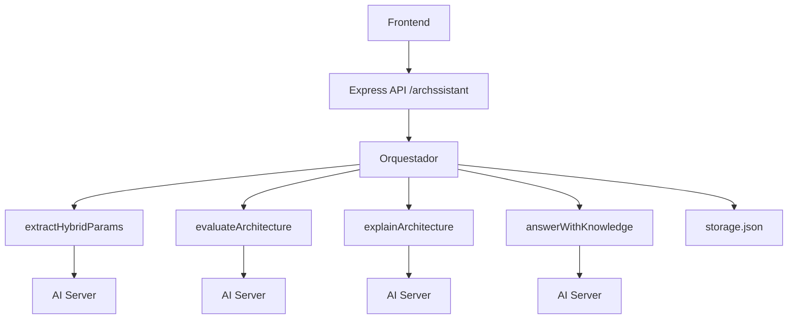
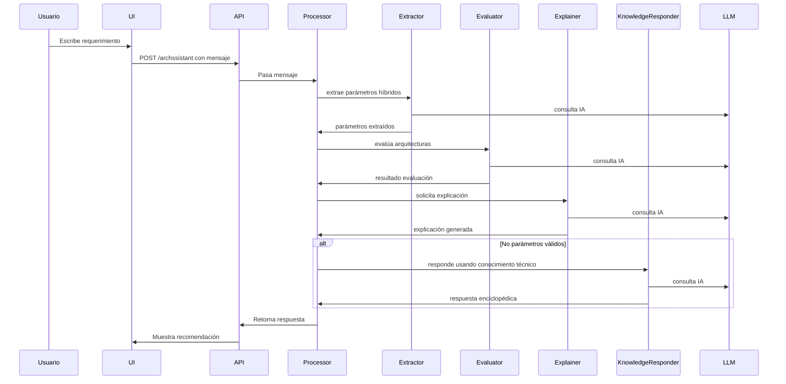

# 🧠 Archssistant


actualmente desplegado aqui https://archssistant.onrender.com/

**Archssistant** es un asistente experto en arquitectura de software, diseñado para evaluar necesidades técnicas y recomendar arquitecturas adecuadas basándose únicamente en los libros:

- *Fundamentals of Software Architecture* — Richards & Ford — ISBN: 978-1-492-04345-4  
- *Software Architecture: The Hard Parts* — Ford, Richards, Sadalage, Dehghani — ISBN: 978-1-492-08689-5

---

## 🏗️ Diagrama de Arquitectura



---

## 🔄 Flujo de Procesamiento



---

## ⚙️ Componentes del Core

### 1. `routes/archassistant.js`
Orquesta la secuencia principal: extrae parámetros, evalúa arquitecturas y explica la recomendación. Si no hay parámetros válidos, usa el KnowledgeResponder.

### 2. `extractHybridParams.js`
Combina dos métodos para identificar parámetros relevantes:
- `param_analyzer.js`: Usa un archivo JSON (`param_rules.json`) para mapear frases clave a parámetros técnicos como `seguridad`, `escalabilidad`, etc.
- `extractor.js`: Usa LLM para inferir parámetros si el input no es explícito.

### 3. `evaluateArchitecture.js`
Evalúa arquitecturas usando una tabla de decisión (`decision_engine.json`) que contiene valores numéricos para cada arquitectura según distintos parámetros. Calcula un score normalizado por pesos.

### 4. `explainArchitecture.js`
Llama al modelo LLM con un **prompt en español**, estructurado y validado, que:
- Resume los parámetros recibidos
- Justifica la arquitectura recomendada exclusivamente con base en los libros mencionados
- Ofrece ventajas, desventajas y una conclusión clara

### 5. `answerWithKnowledge.js`
Si no se detectan parámetros válidos, se consulta este módulo que devuelve respuestas enciclopédicas técnicas sobre arquitectura.

---

## 📌 Requisitos

- Node.js 20+
- `.env` con:
  - `GROQ_KEY`
  - `AISERVER`

---

## 🚧 Limitaciones Actuales

- Dependencia de calidad del LLM
- Reglas de `param_rules.json` pueden no cubrir todos los matices
- Historial almacenado solo en `storage.json`
- No entrega código ni implementaciones, solo recomendaciones

---

## 🧪 Ejemplo de uso

**Input del usuario:**  
> Somos un banco con alta necesidad de seguridad, datos sensibles y escalabilidad horizontal.

**Respuesta esperada:**
```
📊 Evaluación:
CQRS: 0.92
Microservicios: 0.78
Serverless: 0.45

🧠 Recomendación:
✅ Arquitectura sugerida: CQRS
📌 Parámetros relevantes: seguridad, escalabilidad
➕ Ventajas: separación de comandos/consultas, control granular, integridad
➖ Posibles limitaciones: complejidad de mantenimiento, curva de aprendizaje
📚 Justificación: descrito en "Fundamentals..." como ideal para dominio crítico
💬 Conclusión: Ideal para bancos que manejan información crítica
```

---

## 📁 Archivos Clave

| Archivo                         | Propósito                                        |
|--------------------------------|--------------------------------------------------|
| `core/hybridExtractor.js`      | Extracción combinada de parámetros               |
| `core/evaluator.js`            | Evaluación y scoring de arquitecturas            |
| `core/explainer.js`            | Prompts y explicación basada en libros           |
| `core/param_rules.json`        | Reglas de extracción local de parámetros         |
| `core/knowledge_responder.js`  | Alternativa enciclopédica si no hay parámetros   |
| `decision_engine.json`         | Tabla de características de arquitecturas        |

---

## ✨ Roadmap Futuro

- Integración con almacenamiento persistente
- UI mejorada con React o Vue
- Árboles de decisión interactivos
- Adaptación a dominios específicos: banca, salud, educación
