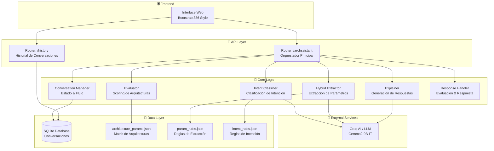
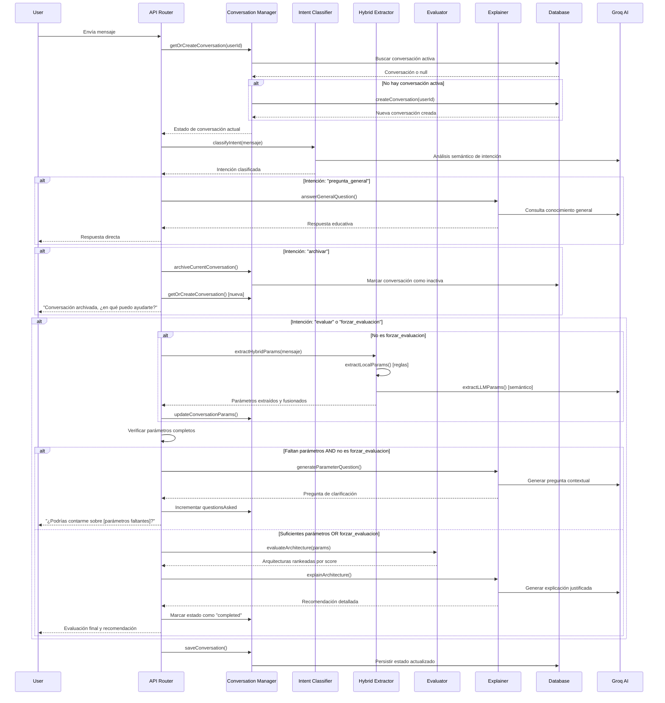
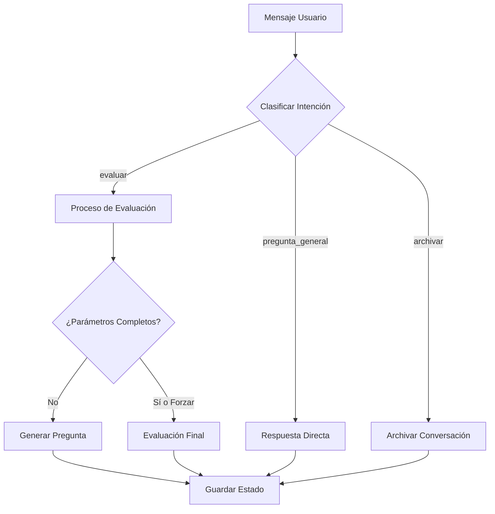
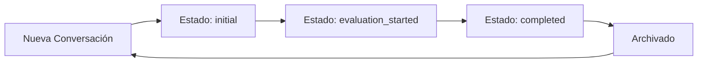
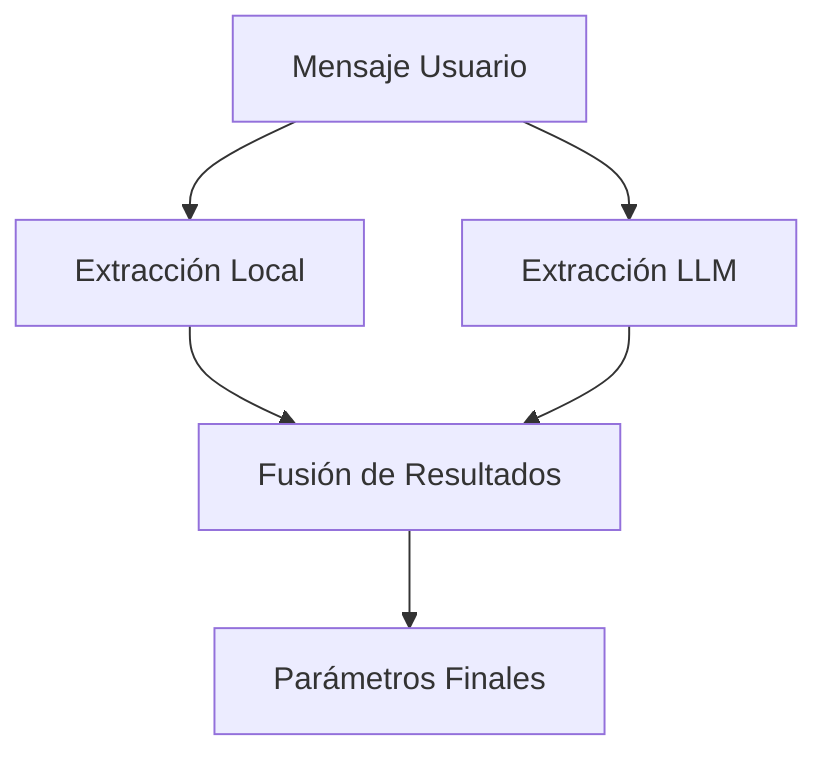
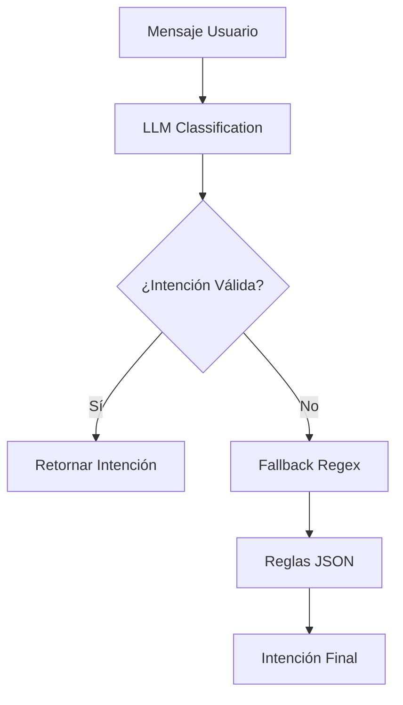

# 🧠 Archssistant

**Desplegado en:** https://archssistant.onrender.com/

**Archssistant** es un asistente conversacional especializado en arquitectura de software que evalúa necesidades técnicas y recomienda arquitecturas adecuadas. El sistema está estrictamente basado en los conocimientos de:

- *Fundamentals of Software Architecture* — Richards & Ford — ISBN: 978-1-492-04345-4  
- *Software Architecture: The Hard Parts* — Ford, Richards, Sadalage, Dehghani — ISBN: 978-1-492-08689-5

---

## 🏗️ Arquitectura del Sistema

El sistema implementa una **arquitectura conversacional modular** con gestión de estado persistente, donde cada componente tiene responsabilidades específicas orquestadas por el manejador de conversaciones.



---

## 🔄 Flujo de Procesamiento Conversacional

El sistema mantiene un **estado conversacional persistente** donde cada interacción del usuario avanza hacia la recomendación final a través de fases bien definidas.



---

## 🗂️ Gestión de Conversaciones y Estados

### Estados de Conversación
- **`initial`**: Conversación recién creada, esperando primer input del usuario
- **`evaluation_started`**: Usuario ha iniciado proceso de evaluación de arquitectura  
- **`completed`**: Evaluación completada y recomendación entregada

### Ciclo de Vida de Conversaciones
- **Activa**: Solo una conversación por usuario puede estar activa (`isActive: 1`)
- **Archivada**: Conversaciones completadas o archivadas manualmente (`isActive: 0`)
- **Persistencia**: SQLite con campos: `id`, `userId`, `params`, `history`, `state`, `isActive`, `questionsAsked`, `createdAt`, `updatedAt`

### Visualización de Conversaciones Archivadas
- **Endpoint**: `GET /archssistant/history/:userId`
- **Funcionalidad**: Retorna todas las conversaciones del usuario ordenadas por `updatedAt` DESC
- **Interfaz**: Panel de historial en la UI que muestra:
  - ID de conversación
  - Estado final
  - Parámetros capturados
  - Timestamp de última actualización
  - Historial completo de mensajes

---

## 🧩 Componentes del Core Detallados

### 1. **Router Principal** (`routes/archassistant.js`)
**Función**: Orquestador central que coordina todo el flujo de procesamiento.



**Responsabilidades**:
- Gestión de rutas HTTP y validación de entrada
- Coordinación entre todos los módulos del core
- Manejo de la lógica de flujo conversacional
- Control de límites (3 preguntas máximo antes de sugerir evaluación)

### 2. **Conversation Manager** (`core/conversation_manager.js`)
**Función**: Gestor del ciclo de vida y estado de las conversaciones.



**Métodos Principales**:
- `getOrCreateConversation(userId)`: Obtiene conversación activa o crea nueva
- `saveConversation(conversation)`: Persiste estado en base de datos
- `updateConversationParams(conversation, newParams)`: Actualiza parámetros extraídos
- `archiveCurrentConversation(userId)`: Archiva conversación activa

**Estructura de Conversación**:
```javascript
{
  id: "uuid",
  userId: "string",
  params: { escalabilidad: "alto", costo: "bajo", ... },
  history: [{ role: "user|assistant", content: "mensaje" }],
  state: "initial|evaluation_started|completed",
  isActive: boolean,
  questionsAsked: number,
  createdAt: "timestamp",
  updatedAt: "timestamp"
}
```

### 3. **Intent Classifier** (`core/intent_classifier.js`)
**Función**: Clasificación híbrida de intención del usuario (LLM + Reglas).

**Intenciones Soportadas**:
- `evaluar`: Usuario quiere recomendación de arquitectura
- `forzar_evaluacion`: Usuario insiste en evaluación con datos actuales
- `pregunta_general`: Consulta educativa sobre arquitectura
- `archivar`: Usuario quiere terminar conversación actual

**Algoritmo**:
1. **LLM Primary**: Uso de Groq/Gemma2-9B-IT para análisis semántico
2. **Regex Fallback**: Sistema de reglas predefinidas desde `intent_rules.json`

**Estructura de Reglas**:
```json
{
  "evaluar": [
    {
      "type": "any",
      "patterns": ["(necesito|busco|quiero|arquitectura para)"]
    }
  ]
}
```

### 4. **Hybrid Extractor** (`core/hybrid_extractor.js`)
**Función**: Extracción dual de parámetros arquitectónicos.



**Parámetros Extraídos**:
- `escalabilidad`: bajo(1) | medio(2) | alto(3)
- `costo`: bajo(1) | medio(2) | alto(3)
- `seguridad`: bajo(1) | medio(2) | alto(3)
- `complejidad`: bajo(1) | medio(2) | alto(3)
- `experiencia`: bajo(1) | medio(2) | alto(3)
- `mantenibilidad`: bajo(1) | medio(2) | alto(3)

**Algoritmo de Fusión**:
1. **Local**: Matching por palabras clave con `param_rules.json`
2. **LLM**: Análisis semántico contextual con Groq
3. **Merge**: Prioridad a LLM, fallback a local

### 5. **Evaluator** (`core/evaluator.js`)
**Función**: Motor de scoring y ranking de arquitecturas.

**Algoritmo de Evaluación**:
```javascript
// Distancia vectorial normalizada
score = 1 - (distanciaPromedio / 2)
```

**Matriz de Arquitecturas** (`architecture_params.json`):
```json
{
  "name": "Microservicios",
  "escalabilidad": 3,
  "complejidad": 3,
  "experiencia": 2,
  "costo": 1,
  "mantenibilidad": 2,
  "seguridad": 2
}
```

**Arquitecturas Soportadas**:
- Monolítica, Layered, Hexagonal, Microkernel
- Service-Based, Microservicios, Event-Driven
- Space-Based, Orchestrator-Based, Microservices

### 6. **Explainer** (`core/explainer.js`)
**Función**: Generación de explicaciones y preguntas contextuales.

**Funcionalidades**:
- `explainArchitecture()`: Justificación detallada basada en libros de referencia
- `generateParameterQuestion()`: Preguntas inteligentes para parámetros faltantes
- `answerGeneralQuestion()`: Respuestas educativas sobre arquitectura

**Formato de Respuesta**:
```
✅ Arquitectura sugerida: {nombre}
📌 Parámetros relevantes: {lista}
➕ Ventajas: {justificación}
➖ Limitaciones: {desventajas}
📚 Justificación técnica: {referencia a libros}
💬 Conclusión: {recomendación final}
```

### 7. **Response Handler** (`core/response_handler.js`)
**Función**: Coordinador final de evaluación y respuesta.

**Proceso**:
1. Ejecuta evaluación de arquitecturas
2. Obtiene arquitectura principal y fallback
3. Genera explicación detallada
4. Formatea respuesta con scores y justificación

### 8. **Database Layer** (`db/database.js`)
**Función**: Abstracción de persistencia con SQLite.

**Operaciones Principales**:
- `initializeDatabase()`: Setup inicial y migraciones
- `createConversation()`: Nueva conversación (archiva anteriores)
- `getActiveConversation()`: Conversación activa del usuario
- `getConversations()`: Historial completo del usuario
- `archiveConversation()` / `unarchiveConversation()`: Gestión de archivado

**Schema SQLite**:
```sql
CREATE TABLE conversations (
  id TEXT PRIMARY KEY,
  userId TEXT NOT NULL,
  params TEXT,           -- JSON serializado
  history TEXT,          -- JSON serializado  
  state TEXT,
  isActive INTEGER,      -- 0/1 boolean
  questionsAsked INTEGER,
  createdAt DATETIME,
  updatedAt DATETIME
);
```

---

## � Sistema de Parámetros y Scoring

### Matriz de Parámetros Arquitectónicos

El sistema evalúa **6 parámetros clave** que caracterizan cada arquitectura en una escala de 1-3:

| Parámetro | Descripción | Escala |
|-----------|-------------|---------|
| **Escalabilidad** | Capacidad de manejar aumento de carga/usuarios | 1=Baja, 2=Media, 3=Alta |
| **Costo** | Costo de implementación y operación | 1=Alto, 2=Medio, 3=Bajo |
| **Seguridad** | Nivel de protección y control de acceso | 1=Básica, 2=Media, 3=Alta |
| **Complejidad** | Dificultad de implementación y comprensión | 1=Simple, 2=Media, 3=Compleja |
| **Experiencia** | Nivel de experiencia requerido del equipo | 1=Avanzada, 2=Media, 3=Básica |
| **Mantenibilidad** | Facilidad de mantenimiento a largo plazo | 1=Difícil, 2=Media, 3=Fácil |

### Algoritmo de Scoring

**Fórmula de Distancia Vectorial**:
```javascript
// Para cada arquitectura
score = 1 - (distanciaPromedio / rangoMaximo)

// Donde:
distancia = |valorUsuario - valorArquitectura| / 2
distanciaPromedio = suma(distancias) / parametrosEvaluados
```

**Ejemplo Práctico**:
```javascript
// Usuario requiere: escalabilidad=alto(3), costo=bajo(3)
// Microservicios: escalabilidad=3, costo=1

distanciaEscalabilidad = |3-3| / 2 = 0.0
distanciaCosto = |3-1| / 2 = 1.0
distanciaPromedio = (0.0 + 1.0) / 2 = 0.5
score = 1 - 0.5 = 0.5 (50% match)
```

### Extracción de Parámetros

**Método Híbrido** (Local + LLM):

1. **Extracción Local** (`param_rules.json`):
```json
{
  "escalabilidad": {
    "alto": ["muy escalable", "millones de usuarios", "alta carga"],
    "medio": ["escalable", "carga media"],
    "bajo": ["pocos usuarios", "sin escalamiento"]
  }
}
```

2. **Extracción LLM** (Semántica):
```javascript
systemPrompt = `
Analiza y extrae parámetros arquitectónicos:
- escalabilidad, costo, seguridad, complejidad, experiencia, mantenibilidad
- Valores: "alto", "medio", "bajo", "desconocido"
- Respuesta: solo JSON válido
`
```

3. **Fusión**: `resultado = { ...local, ...llm }` (prioridad a LLM)

---

## 🔍 Sistema de Intenciones

### Clasificación de Intenciones

**Método Híbrido** (LLM + Regex):

| Intención | Descripción | Ejemplos |
|-----------|-------------|----------|
| `evaluar` | Solicitud de recomendación arquitectónica | "necesito una arquitectura", "mi app tendrá mucho tráfico" |
| `forzar_evaluacion` | Insistir en evaluación con datos actuales | "evalúa con lo que tienes", "dame respuesta ya" |
| `pregunta_general` | Consulta educativa sobre arquitectura | "¿qué es escalabilidad?", "microservicios vs monolítico" |
| `archivar` | Terminar conversación y empezar nueva | "archivar conversación", "empezar de nuevo" |

### Flujo de Decisión de Intenciones



---

## 🏛️ Arquitecturas Soportadas

### Catálogo de Arquitecturas

El sistema evalúa **10 patrones arquitectónicos** principales:

| Arquitectura | Escalabilidad | Complejidad | Costo | Casos de Uso Típicos |
|--------------|---------------|-------------|-------|---------------------|
| **Monolítica** | 1 (Baja) | 1 (Simple) | 3 (Bajo) | Startups, MVPs, equipos pequeños |
| **Layered** | 2 (Media) | 2 (Media) | 2 (Medio) | Aplicaciones empresariales tradicionales |
| **Hexagonal** | 2 (Media) | 2 (Media) | 2 (Medio) | DDD, testing extensivo |
| **Microkernel** | 2 (Media) | 2 (Media) | 2 (Medio) | Sistemas con plugins/extensiones |
| **Service-Based** | 3 (Alta) | 2 (Media) | 2 (Medio) | SOA moderno, integración B2B |
| **Microservicios** | 3 (Alta) | 3 (Compleja) | 1 (Alto) | Empresas grandes, equipos distribuidos |
| **Event-Driven** | 3 (Alta) | 3 (Compleja) | 1 (Alto) | Sistemas reactivos, IoT |
| **Space-Based** | 3 (Alta) | 3 (Compleja) | 1 (Alto) | Alta concurrencia, gaming |
| **Orchestrator-Based** | 3 (Alta) | 3 (Compleja) | 1 (Alto) | Workflows complejos, BPM |
| **Pipeline** | 2 (Media) | 2 (Media) | 2 (Medio) | Procesamiento de datos, ETL |

### Proceso de Recomendación

1. **Scoring**: Cálculo de similitud para cada arquitectura
2. **Ranking**: Ordenamiento por score descendente  
3. **Validación**: Verificación de justificación en libros de referencia
4. **Fallback**: Arquitectura alternativa si la primera no tiene soporte
5. **Explicación**: Generación de recomendación detallada con pros/contras

---

## 💻 Configuración y Requisitos

### Requisitos del Sistema
- **Node.js**: 20+ 
- **Base de Datos**: SQLite (archivo local)
- **AI Service**: Groq API con modelo Gemma2-9B-IT

### Variables de Entorno
```env
GROQ_API_KEY=tu_clave_groq_aqui
AISERVER=https://api.groq.com/openai/v1
PORT=3000
```

### Instalación y Ejecución
```bash
# Instalación
npm install

# Desarrollo
npm run dev

# Producción  
npm start

# Testing
npm test
```

### Estructura de Archivos Clave

| Archivo | Propósito |
|---------|-----------|
| `routes/archassistant.js` | Router principal y orquestador |
| `core/conversation_manager.js` | Gestión de estado conversacional |
| `core/intent_classifier.js` | Clasificación híbrida de intenciones |
| `core/hybrid_extractor.js` | Extracción dual de parámetros |
| `core/evaluator.js` | Motor de scoring arquitectónico |
| `core/explainer.js` | Generación de explicaciones y preguntas |
| `core/response_handler.js` | Coordinador de evaluación final |
| `db/database.js` | Capa de persistencia SQLite |
| `core/architecture_params.json` | Matriz de características arquitectónicas |
| `core/param_rules.json` | Reglas de extracción local |
| `core/intent_rules.json` | Patrones de clasificación de intenciones |
| `public/index.html` | Interface web con estilo retro |

---

## 🚧 Limitaciones y Consideraciones

### Limitaciones Técnicas
- **Dependencia de LLM**: Calidad de respuestas sujeta a disponibilidad y rendimiento de Groq API
- **Cobertura de Reglas**: `param_rules.json` puede no capturar todos los matices del lenguaje natural
- **Persistencia Local**: Base de datos SQLite local (no distribuida)
- **Escalabilidad**: Diseñado para uso moderado, no para alta concurrencia
- **Idioma**: Optimizado para español, soporte limitado en otros idiomas

### Limitaciones de Alcance
- **Solo Recomendaciones**: No genera código, diagramas o implementaciones
- **Conocimiento Fijo**: Limitado a los dos libros de referencia especificados
- **Contexto de Dominio**: No especializado en dominios específicos (salud, finanzas, etc.)
- **Integración**: No se integra con herramientas de desarrollo o repositorios

### Consideraciones de Uso
- **Conversaciones Largas**: Límite sugerido de 3 preguntas antes de forzar evaluación
- **Parámetros Mínimos**: Requiere al menos un parámetro identificado para evaluación
- **Sesiones de Usuario**: Una conversación activa por usuario (las demás se archivan automáticamente)

---

## 🧪 Ejemplos de Uso

### Ejemplo 1: Evaluación Completa
**Input del usuario:**  
> "Somos un banco con alta necesidad de seguridad, datos sensibles y escalabilidad horizontal, pero tenemos presupuesto limitado."

**Parámetros extraídos:**
```json
{
  "seguridad": "alto",
  "escalabilidad": "alto", 
  "costo": "alto" // (presupuesto limitado = costo debe ser bajo, pero invertido)
}
```

**Respuesta esperada:**
```
Basado en nuestra conversación, aquí tienes mi recomendación:

Evaluación:
Service-Based: 0.83
Layered: 0.67
Hexagonal: 0.58

Recomendación:
✅ Arquitectura sugerida: Service-Based
📌 Parámetros relevantes: seguridad, escalabilidad, costo
➕ Ventajas: Control granular de seguridad, escalabilidad por servicios, menor complejidad que microservicios
➖ Limitaciones: Requiere governance de servicios, posible latencia entre servicios
📚 Justificación técnica: Según "Fundamentals of Software Architecture", ideal para organizaciones que requieren balance entre escalabilidad y control
💬 Conclusión: Perfecta para instituciones financieras que necesitan seguridad robusta con escalabilidad controlada
```

### Ejemplo 2: Pregunta General
**Input del usuario:**  
> "¿Cuál es la diferencia entre microservicios y arquitectura monolítica?"

**Respuesta:**
```
Las principales diferencias son:

**Arquitectura Monolítica:**
- Todo el código en una sola aplicación deployable
- Escalamiento vertical (toda la app)
- Tecnología homogénea
- Debugging más simple
- Ideal para equipos pequeños y proyectos simples

**Microservicios:**
- Servicios independientes y deployables por separado
- Escalamiento horizontal (servicios específicos)
- Tecnologías heterogéneas permitidas
- Debugging distribuido más complejo
- Ideal para equipos grandes y sistemas complejos

La elección depende del tamaño del equipo, complejidad del dominio y requisitos de escalabilidad.
```

### Ejemplo 3: Archivado de Conversación
**Input del usuario:**  
> "Archivar conversación"

**Respuesta:**
```
¡Conversación archivada! He guardado todo nuestro historial y estoy listo para empezar una nueva conversación. ¿En qué puedo ayudarte ahora? 😊
```

### Ejemplo 4: Forzado de Evaluación
**Input del usuario (después de 2-3 preguntas):**  
> "Evalúa ya con lo que tienes"

**Sistema:** Procede con evaluación usando parámetros conocidos, ignorando los faltantes.

---

## 🔮 Roadmap Futuro

### Mejoras a Corto Plazo
- **UI/UX Mejorada**: Migración a React/Vue con componentes modernos
- **Exportación**: Generar PDFs con recomendaciones y justificaciones
- **Métricas**: Dashboard de uso y estadísticas de recomendaciones
- **API Docs**: Documentación Swagger/OpenAPI

### Mejoras a Mediano Plazo
- **Integración Cloud**: Soporte para bases de datos distribuidas (PostgreSQL, MongoDB)
- **Multiidioma**: Soporte completo para inglés y otros idiomas
- **Especialización por Dominio**: Módulos específicos para banca, salud, e-commerce
- **Comparación Visual**: Gráficos de radar para comparar arquitecturas

### Mejoras a Largo Plazo
- **Generación de Código**: Templates básicos para arquitecturas recomendadas
- **Integración DevOps**: Conectores con Kubernetes, Docker, CI/CD
- **Árbol de Decisión Interactivo**: Flujo visual para selección de arquitectura
- **Machine Learning**: Modelo personalizado entrenado en patrones arquitectónicos

---

## 📁 Archivos de Configuración

### `architecture_params.json`
Matriz de características para cada patrón arquitectónico con valores 1-3 para los 6 parámetros clave.

### `param_rules.json`  
Reglas de extracción local por palabras clave, organizadas por parámetro y nivel (alto/medio/bajo).

### `intent_rules.json`
Patrones regex para clasificación de intenciones como fallback del LLM.

### Esquema de Base de Datos
```sql
CREATE TABLE conversations (
    id TEXT PRIMARY KEY,
    userId TEXT NOT NULL,
    params TEXT,           -- JSON: parámetros extraídos
    history TEXT,          -- JSON: historial de mensajes  
    state TEXT,            -- Estado: initial|evaluation_started|completed
    isActive INTEGER,      -- 0=archivada, 1=activa
    questionsAsked INTEGER,-- Contador de preguntas realizadas
    createdAt DATETIME,
    updatedAt DATETIME
);
```

---

## 🤝 Contribuciones

Para contribuir al proyecto:

1. **Fork** del repositorio
2. **Crear branch** para la feature: `git checkout -b feature/nueva-funcionalidad`
3. **Commit** cambios: `git commit -m 'Añadir nueva funcionalidad'`
4. **Push** al branch: `git push origin feature/nueva-funcionalidad`
5. **Crear Pull Request**

### Guidelines de Desarrollo
- Seguir convenciones de código existentes
- Añadir tests para nuevas funcionalidades
- Actualizar documentación según cambios
- Mantener compatibilidad con los libros de referencia establecidos

---

## 📄 Licencia

Este proyecto está bajo la Licencia ISC. Ver el archivo `LICENSE` para más detalles.

---

## 📞 Soporte

Para preguntas, issues o sugerencias:
- **GitHub Issues**: [Repositorio del proyecto]
- **Documentación**: Este README y comentarios en el código
- **Testing**: Ejecutar `npm test` para validar funcionalidad

**¡Gracias por usar Archssistant! 🚀**
